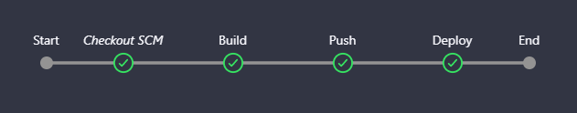

# Ejercicio Devops

## Resumen

Este ejercicio tiene como objetivo desplegar una aplicación tipo REST API alojada en un repositorio de GitHub, utilizando Jenkins como herramienta CI/CD y Docker para la contenedorización y despliegue de la aplicación.

### Sobre la aplicación
Como se requiere una REST API y además se solicita que cuente con Swagger para verificar su funcionamiento se optó por escribir una pequeña aplicación en Python utilizando FastAPI. La misma cuenta con endpoints de ejemplo para los métodos típicos utilizados en un CRUD.

### Jenkins

Se corre de manera local el servicio de Jenkins en un contenedor. A partir del siguiente Dockerfile se crea una imagen de Jenkins que cuente con Docker ya configurado.

```dockerfile
FROM jenkins/jenkins:lts
USER root
RUN apt-get update && \
    apt-get -y install apt-transport-https \
    ca-certificates \
    curl \
    gnupg2 \
    software-properties-common && \
    curl -fsSL https://download.docker.com/linux/$(. /etc/os-release; echo "$ID")/gpg > /tmp/dkey; apt-key add /tmp/dkey && \
    add-apt-repository \
    "deb [arch=amd64] https://download.docker.com/linux/$(. /etc/os-release; echo "$ID") \
    $(lsb_release -cs) \
    stable" && \
    apt-get update && \
    apt-get -y install docker-ce
RUN apt-get install -y docker-ce
RUN usermod -a -G docker jenkins
USER jenkins
```

Creamos la imagen con `docker build -t <nombre_imagen> .` y luego creamos y desplegamos un contenedor a partir de nuestra imagen Jenkins con 

`docker run --group-add 0 --name jenkins-docker-pruebas -p 20000:8080 -p 50000:50000 -v //var/run/docker.sock:/var/run/docker.sock <nombre_imagen>`

Vease que se utiliza un socket entre Windows y el contenedor mediante `-v //var/run/docker.sock:/var/run/docker.sock`.

## Configuraciones en Jenkins

### Pipeline

Se genera un nuevo Pipeline que utiliza como archivo Jenkinsfile al del presente repositorio, a su vez se realizan las configuraciones para que un nuevo commit a la rama main genere un nuevo build en Jenkins (Build Trigger).

Las etapas del pipeline se resumen en la siguiente imagen


- Checkout SCM: Descarga el código desde el repositorio de Github.
- Building image: Mediante docker se realiza el build de la imagen.
- Push Image: Se pushea la imagen al repositorio de imágenes Dockerhub.
- Deploy: Mediante docker se crea un contenedor y despliega la aplicación.

### Ngrok

Se utiliza Ngrok como tunel para dar acceso al Webhook de Github a Jenkins de manera de disparar el build ante un nuevo commit. Para el puerto utilizado en el contenedor de Jenkins se utiliza el siguiente comando `ngrok http 20000 --host-header="localhost:20000"`. Esto devuelve una URL similar a `https://6937-201-253-216-253.ngrok-free.app`, y es la que se utiliza en la configuración de Webhook de Github.

#### Referencias
https://tomgregory.com/aws/running-docker-in-docker-on-windows/